## Exercise 1: Migrate MongoDB to Cosmos DB using Azure Database Migration
  
**Duration**: 60 Minutes

## Overview

In this exercise, you will be migrating your on-premises MongoDB database hosted over Azure Linux VM to Azure CosmosDB using Azure database migration. Azure Database Migration Service is a tool that helps you simplify, guide, and automate your database migration to Azure.

### Task 1: Explore the databases and collections in MongoDB

In this task, you will be connecting to a Mongo database hosted over an Azure Linux VM and exploring the databases and collections in it.

1. Once you log into the VM, search for **cmd** **(1)** in the Windows search bar and click on **Command Prompt** **(2)** to open.

   
    
1. Run the given command **<inject key="Command to Connect to Build Agent VM" enableCopy="true" />** to connect to the Linux VM using ssh.
   
   >**Note**: In the command prompt, type **yes** and press **Enter** for `Are you sure you want to continue connecting (yes/no/[fingerprint])?`
   
1. Once the SSH is connected to the VM, please enter the VM password given below:
   
   * Password: **<inject key="Build Agent VM Password" enableCopy="true" />**

      

      >**Note**: Please note that while typing the password, you won’t be able to see it due to security concerns.

1. While connected to your Linux VM, run the following command to verify whether MongoDB is installed:

   ```
   mongo --version
   ```

      

   >**Note:** If MongoDB is installed, proceed to the next step. If it is not installed, follow the troubleshooting steps provided below.

   >Run the **<inject key="Command to Connect to Build Agent VM" enableCopy="true" />** command, Type **yes** when it says **Are you sure you want to continue connecting (yes/no/[fingerprint])?** and enter the VM password **<inject key="Build Agent VM Password" enableCopy="true" />** to connect to the Linux VM using ssh. Please run the following commands.

   ```
   sudo apt install mongodb-server
   cd /etc
   sudo sed -i 's/bind_ip = 127.0.0.1/bind_ip = 0.0.0.0/g' /etc/mongodb.conf
   sudo sed -i 's/#port = 27017/port = 27017/g' /etc/mongodb.conf
   cd ~/Cloud-Native-Application/labfiles/src/developer/content-init
   npm ci
   nodejs server.js   
   sudo service mongodb stop
   sudo service mongodb start
   ```   


2. While connected to your Linux VM, run the following command to connect to the mongo shell to display the databases and collections in it using the mongo shell.

   ```
   mongo
   ```
   

3. Run the following commands to verify the database in the mongo shell. You should be able to see the **contentdb** **(1**) available and **item & products** **(2)** collections inside **contentdb**.

   ```
   show dbs
   use contentdb
   show collections
   ```
   
    

   >**Note**: In case you don't see the data inside the Mongo. Please follow the steps mentioned below.

   - Enter `exit` to exit from Mongo.

   - Please run the below-mentioned commands in the command prompt and perform steps 1 and 2 again.

      ```
      cd ~/Cloud-Native-Application/labfiles/src/developer/content-init
      sudo npm ci
      nodejs server.js
      ```     

### Task 2: Create a Migration Project and migrate data to Azure CosmosDB

In this task, you will create a Migration project within Azure Database Migration Service, and then migrate the data from MongoDB to Azure Cosmos DB. In the later exercises, you will be using the Azure CosmosDB to fetch the data for the products page. 

1. In the Azure portal search bar, enter **Virtual machines (1)** and select **Virtual machines (2)** from the Services list.

   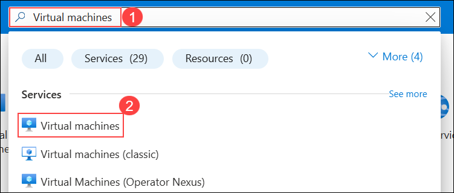

1. From the **Virtual machines** list, select the **contosotraders** virtual machine.

   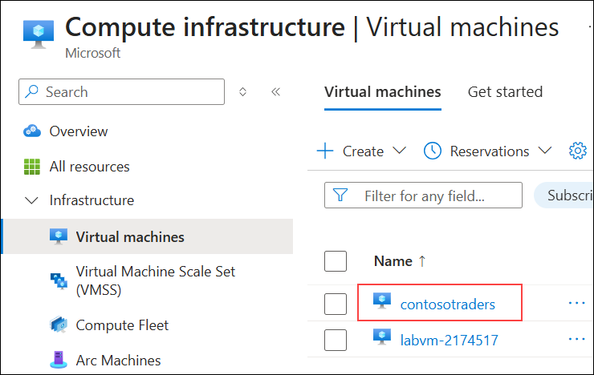

1. In the **Overview** pane, copy the **Private IP address**, and paste it into a notepad for later use.

   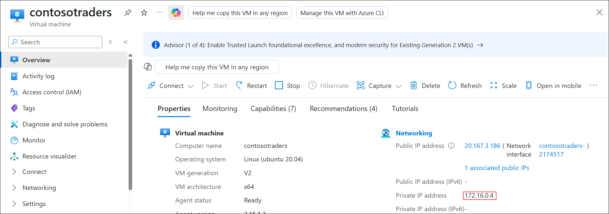

1. In the Azure portal search bar, enter **Azure Cosmos DB (1)** and select **Azure Cosmos DB (2)** from the Services list.

   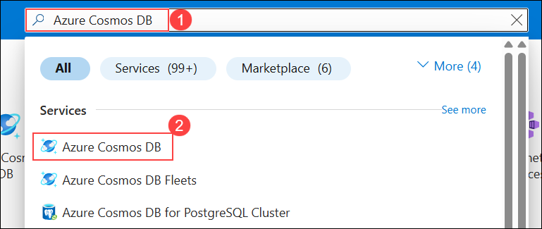

1. In the **Azure Cosmos DB** page, use the filter **(1)** if required, and then select the **contosotraders-<inject key="DeploymentID" enableCopy="false" /> (2)** Cosmos DB resource.

   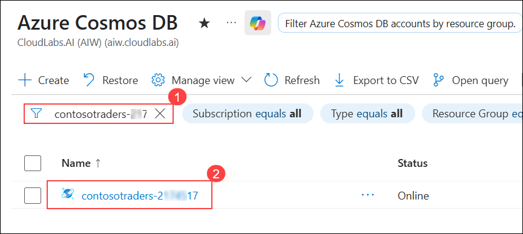

1. From the left navigation pane, select **Data Explorer**.

   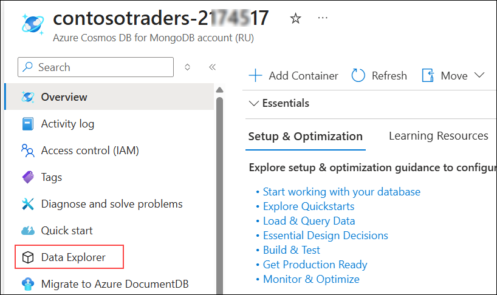

   > **Note:** If you get **Welcome! What is Cosmos DB?** popup, close it by clicking on **X**.

1. In the **Data Explorer** pane, click the drop-down arrow **(1)** next to **New Collection**, and then select **New Database (2)**.

   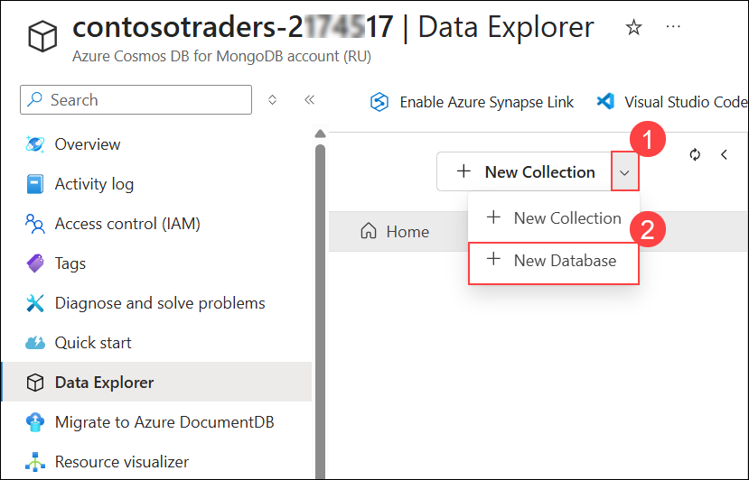

1. Provide name as `contentdb` **(1)** for **Database id**. Select **Provision throughput (2)** and then select **Databse throughput** as **Manual** **(3)**,  provide the RU/s value to `400` **(4)** and click on **OK (5)**.

   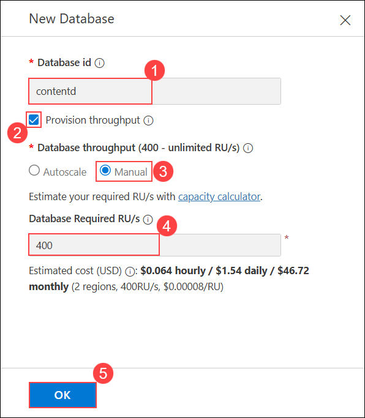

   >**Note:** To see the configurations, ensure that Provision throughput is **Checked**.

1. In the Azure portal search bar, enter **Resource groups (1)** and select **Resource groups (2)** from the Services list.

   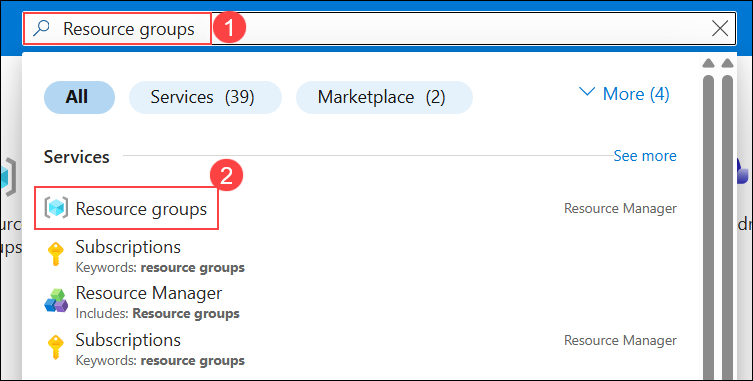

1. From the **Resource groups** list, select the **ContosoTraders-<inject key="DeploymentID" enableCopy="false" />** resource group.

   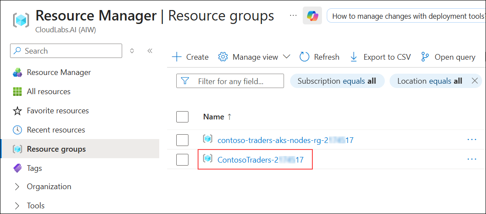

1. In the **Resources** list, use the filter **(1)** if required, and then select the **contosotraders<inject key="DeploymentID" enableCopy="false" /> (2)** Azure Database Migration Service resource.

   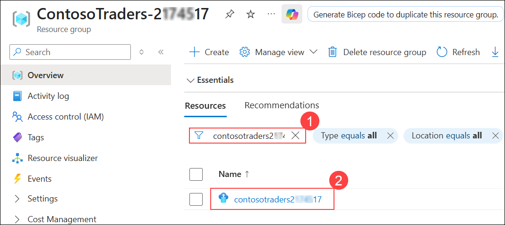

1. On the Azure Database Migration Service blade, select **+ New Migration Project** on the **Overview** pane.

   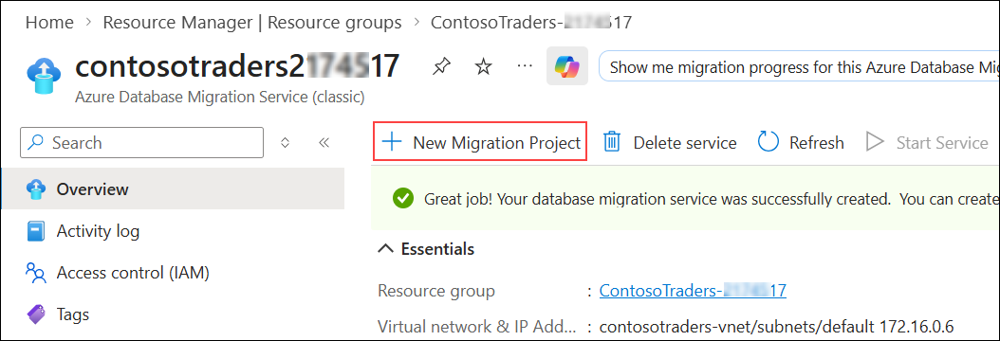

1. On the **New migration project** pane, enter the following values and then select **Create and run activity (5)**:

   - **Project name**: `contoso` **(1)**
   - **Source server type**: `MongoDB` **(2)**
   - **Target server type**: `Cosmos DB (MongoDB API)` **(3)**
   - **Choose type of activity**: `Offline data migration` **(4)**

      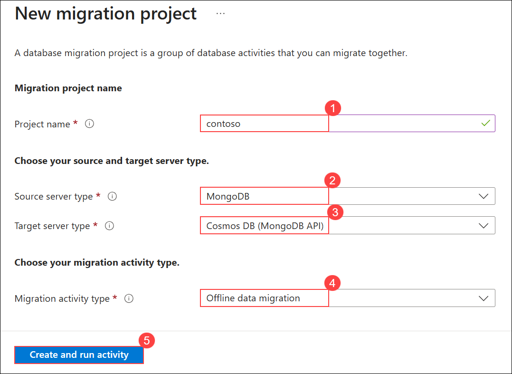

      >**Note**: The **Offline data migration** activity type is selected since you will be performing a one-time migration from MongoDB to Cosmos DB. Also, the data in the database won't be updated during the migration. In a production scenario, you will want to choose the migration project activity type that best fits your solution requirements.

1. On the **MongoDB to Azure Database for CosmosDB Offline Migration Wizard** pane, enter the following values for the **Select source** tab:

   - Mode: **Standard mode (1)**
   - Source server name: Enter the Private IP Address of the Build Agent VM used in this lab. **(2)**
   - Server port: `27017` **(3)**
   - Require SSL: Unchecked **(4)**
   - Choose **Next: Select target >> (5)**

      > **Note:** Leave the **User Name** and **Password** blank as the MongoDB instance on the Build Agent VM for this lab does not have authentication turned on. The Azure Database Migration Service is connected to the same VNet as the Build Agent VM, so it's able to communicate within the VNet directly to the VM without exposing the MongoDB service to the Internet. In production scenarios, you should always have authentication enabled on MongoDB.

      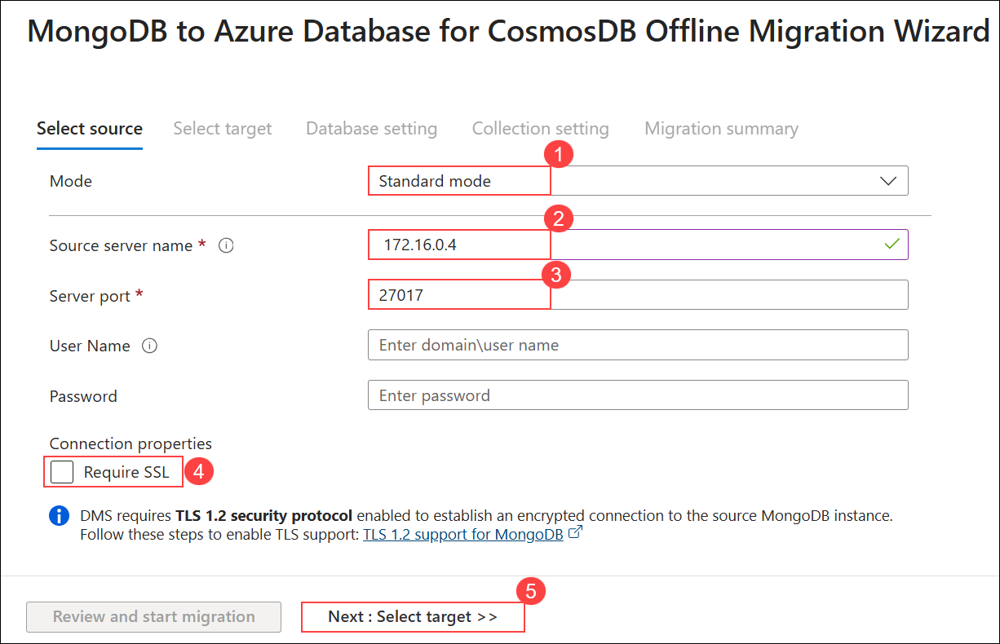

      > **Note:** If you face an issue while connecting to the source DB, with an error connection refused. Please run the following commands in **build agent VM connected in CloudShell**. You can use the **Command to Connect to Build Agent VM**, which is given on the lab environment details page.

      ```bash
      sudo apt install mongodb-server
      cd /etc
      sudo sed -i 's/bind_ip = 127.0.0.1/bind_ip = 0.0.0.0/g' /etc/mongodb.conf
      sudo sed -i 's/#port = 27017/port = 27017/g' /etc/mongodb.conf
      sudo service mongodb stop
      sudo service mongodb start
      ```

1. On the **Select target** pane, select the following values:

   - Mode: **Select Cosmos DB target (1)**
   - Subscription: Select the Azure subscription you're using for this lab. **(2)**
   - Select Cosmos DB name: Select the **contosotraders-<inject key="DeploymentID" enableCopy="false" /> (3)** Cosmos DB instance.
   - Select **Next: Database setting >> (4)**.

      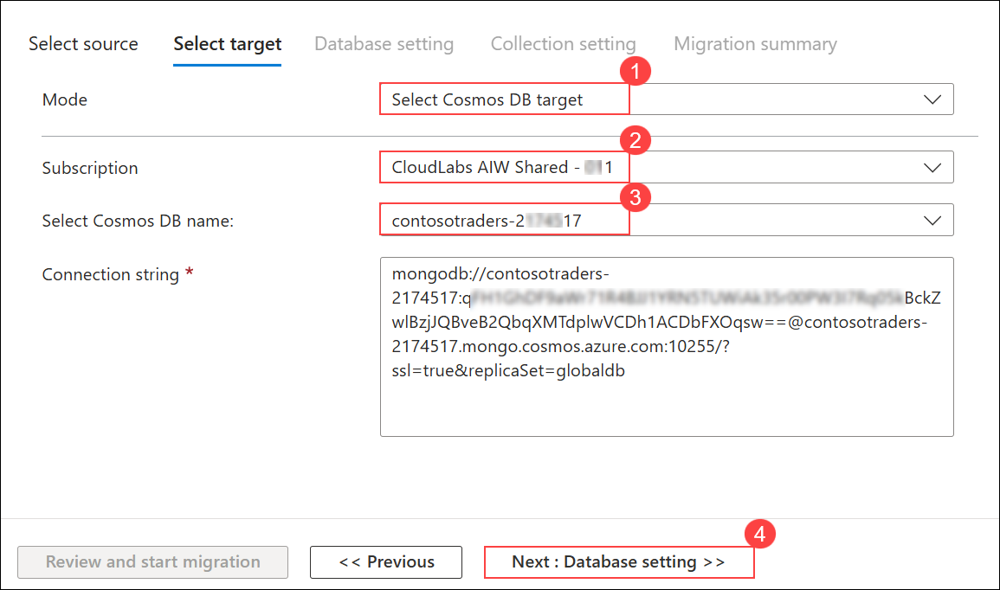

      >**Note:** Notice, the **Connection String** will automatically populate with the Key for your Azure Cosmos DB instance.

1. On the **Database setting** tab, select the `contentdb` as **Source Database (1)**, so this database from MongoDB will be migrated to Azure Cosmos DB. Select **Next: Collection setting >> (2)**.

   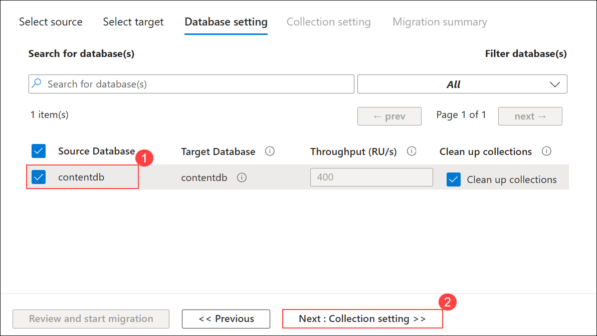

1. On the **Collection setting** tab, expand the **contentdb** database, and ensure both the **products** and **items** collections are selected for migration **(1)**. Also, update the **Throughput (RU/s)** to `400` **(2)** for both collections and select **Next : Migration summary >> (3)**.

   

1. On the **Migration summary** tab, enter `MigrateData` **(1)** in the **Activity name** field, and then select **Start migration (2)** to initiate the migration of the MongoDB data to Azure Cosmos DB.

   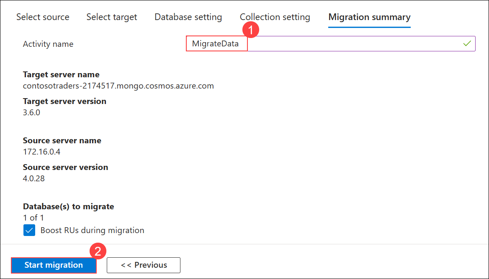

1. Wait for a few seconds after the migration starts, and then select **Refresh**.

   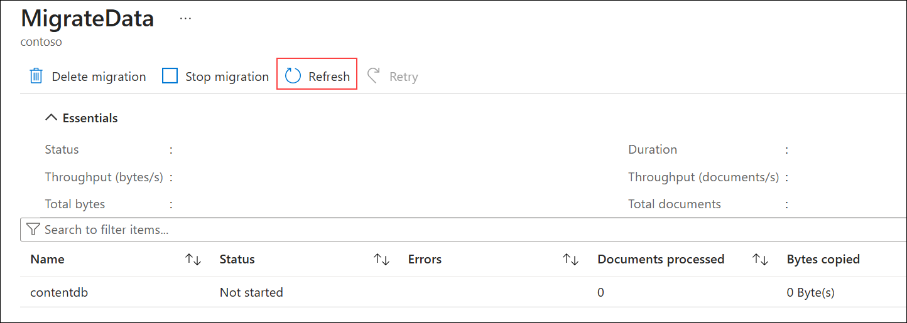

1. The migration activity's status will be displayed. The migration will be finished in a matter of seconds.

   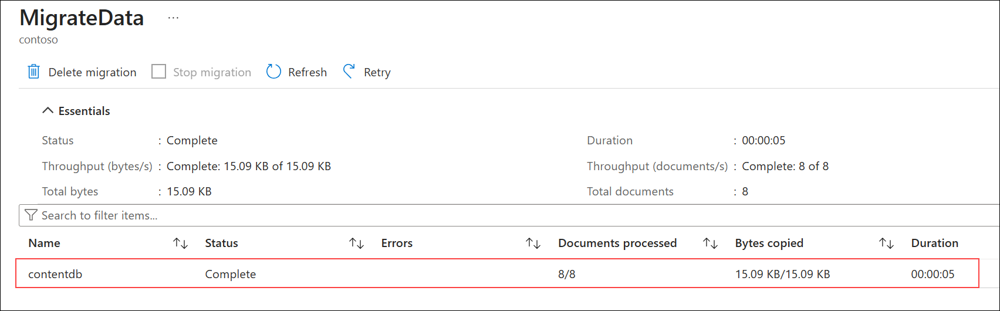

1. Select **Data Explorer (1)** from the left menu. You will see the `items` and `products` collections listed within the `contentdb` database **(2)** and you will be able to explore the documents **(3)**.

   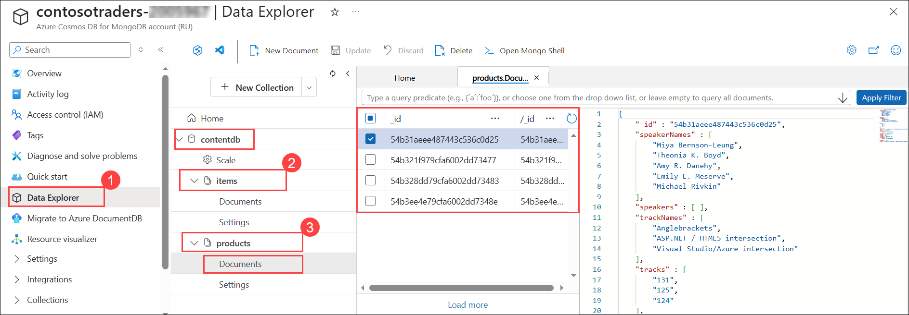

1. You will see the `items` and `products` collections listed within the `contentdb` database and you will be able to explore the documents.

<validation step="6d62857f-8d3a-4e0f-ba85-472c8fcacdbe" />

> **Congratulations** on completing the lab! Now, it's time to validate it. Here are the steps:

  > - Navigate to the Lab Validation tab, from the upper right corner in the lab guide section.
  > - Hit the Validate button for the corresponding task. If you receive a success message, you have successfully validated the lab. 
  > - If not, carefully read the error message and retry the step, following the instructions in the lab guide.
  > - If you need any assistance, please contact us at labs-support@spektrasystems.com.  

## Summary

In this exercise, you have completed exploring your on-prem Mongodb and migrating your on-premises MongoDB database to Azure CosmosDB using Azure database migration.
