# Exercise 1: Build Docker Images for the Application 

### Estimated Duration: 60 Minutes

## Pre-requisites 

Before you move to the next exercise, please make sure to complete this pre-requisite exercises as upcoming exercises are dependent on it.

## Overview

In this exercise, you will learn how to Containerize the Contoso Traders application using Docker images. Containerized applications are applications that run in isolated runtime environments called containers. A Docker image is a file used to execute code in a Docker container. Docker images act as a set of instructions to build a Docker container, like a template. Also, you will be pushing the created Docker images to the Azure Container Registry.

## Objectives

In this exercise, you will complete the following tasks:
- Task 1: Set up a local infrastructure with the Linux VM
- Task 2: Build Docker images to containerize the application and push them to the container registry

### Task 1: Set up a local infrastructure with the Linux VM

In this task, you will be connecting to the Build agent VM using the Command prompt and will be cloning the Contoso trader website GitHub repo.  

1. Once you log into the VM, search for **cmd** **(1)** in the Windows search bar and click on **Command Prompt** **(2)** to open.

   
    
1. Run the given command **<inject key="Command to Connect to Build Agent VM" enableCopy="true" />** to connect to the Linux VM using ssh.
   
   >**Note**: In the command prompt, type **yes** and press **Enter** for `Are you sure you want to continue connecting (yes/no/[fingerprint])?`
   
1. Once the SSH is connected to the VM, please enter the VM password given below:
   
    * Password: **<inject key="Build Agent VM Password" enableCopy="true" />**

      

      >**Note**: Please note that while typing the password, you won’t be able to see it due to security concerns.
    
1. Once the VM is connected, run the below command to clone the GitHub repository that we are going to use for the lab.

   ``` 
   git clone https://github.com/CloudLabsAI-Azure/Cloud-Native-Application
   ```
   
   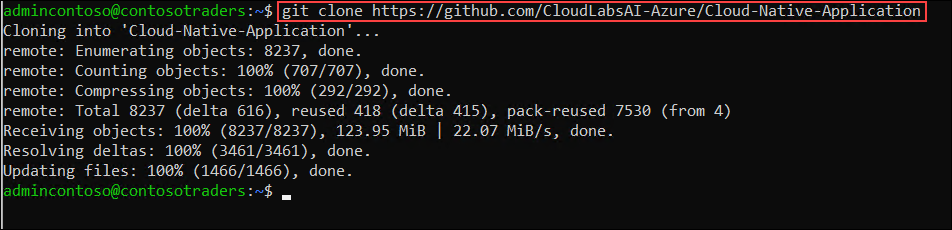
   
   > **Note:** If you receive an output message stating - the destination path 'Cloud-Native-Application' already exists and is not an empty directory. Please run the following commands and then reperform step - 4 of the task.

   ```
   sudo su
   rm -rf Cloud-Native-Application
   exit
   ```   
   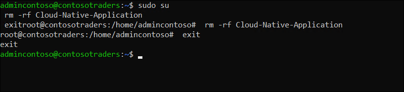
    
1. After the GitHub cloning is completed, run the below command to change the directory to the lab files.
    
   ```
   cd Cloud-Native-Application/labfiles/ 
   ```
   
   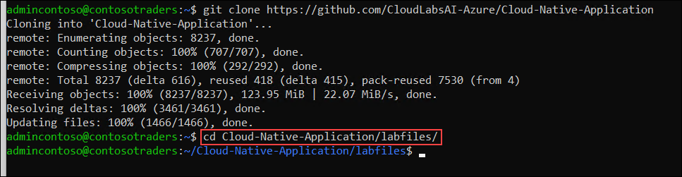
    
### Task 2: Build Docker images to containerize the application and push them to the container registry

In this task, you will be building the docker images to containerize the application and will be pushing them to the ACR (Azure Container Registry) to later use in AKS.

1. Run the below command to log in to Azure, navigate to the device login URL `https://microsoft.com/devicelogin` in the browser and copy the authentication code.

   ``` 
   az login
   ```
    
   

   > **Note:** If `az login` isn’t recognized, install Azure CLI using the commands below, let the setup complete, and then rerun `az login` to proceed

   ``` 
   sudo apt update
   sudo apt install azure-cli -y
   ```
    
1. Enter the copied authentication code **(1)** and click on **Next** **(2)**.

   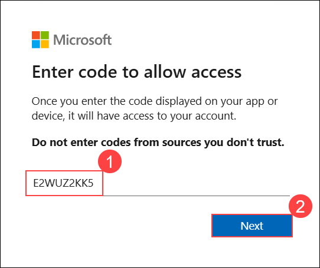
   
1. On the **Sign in to your account** tab you will see a login screen, in that enter the following email/username and then click on **Next**.

   * Email: **<inject key="AzureAdUserEmail"></inject>**

        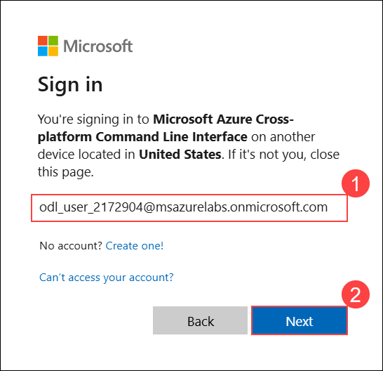

1. Now enter the following Temporary Access Pass and click on **Sign in**.

   * Temporary Access Pass: **<inject key="AzureAdUserPassword"></inject>**

        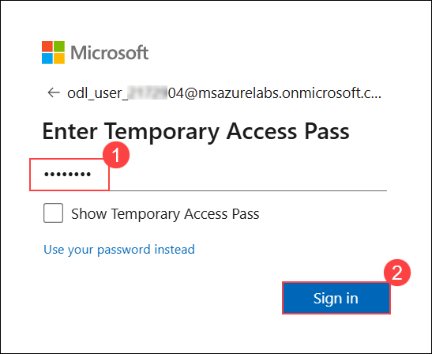

        > **Note:** You will not get the popup to enter the password if you had got the **Pick an account** popup where you had chosen the account.

1. In a pop-up to confirm the sign-into Microsoft Azure CLI, click on **Continue**.

   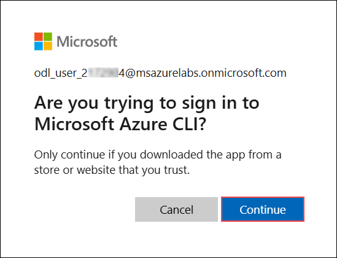

1. After signing-in, you will see a confirmation popup **You have signed in to the Microsoft Azure Cross-platform Command Line Interface application on your device**. Close the browser tab and open the previous Command Prompt session.   

   

1. Once you log in to Azure, you are going to build the Docker images in the next steps and will be pushing them to ACR.

   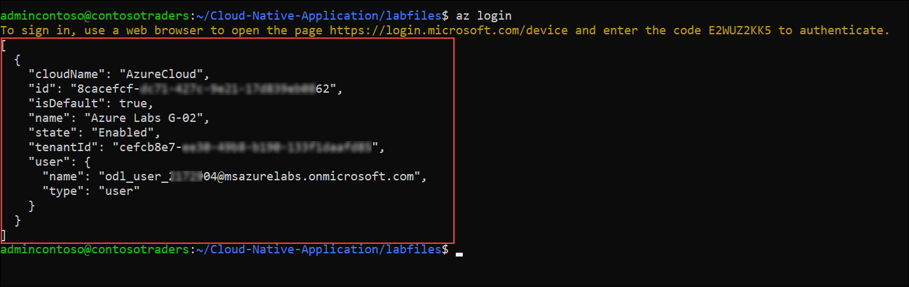

1. Please make sure that you are in the **labfiles** directory before running the next steps as the docker build needs to find the DockerFile to create the image.

   ```
   cd Cloud-Native-Application/labfiles/
   ```
    
1. Now build the **contosotraders-carts** docker image using the Dockerfile in the directory. Take note of how the deployed Azure Container Registry is referenced.

   ```
   docker build src -f ./src/ContosoTraders.Api.Carts/Dockerfile -t contosotradersacr<inject key="DeploymentID" enableCopy="false"/>.azurecr.io/contosotradersapicarts:latest -t contosotradersacr<inject key="DeploymentID" enableCopy="false"/>.azurecr.io/contosotradersapicarts:latest
   ```
    
   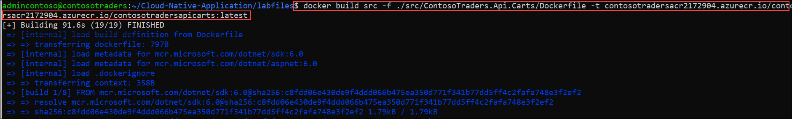
    
1. Repeat the steps to create the **contosotraders-Products** docker image with the below command.

   ```
   docker build src -f ./src/ContosoTraders.Api.Products/Dockerfile -t contosotradersacr<inject key="DeploymentID" enableCopy="false"/>.azurecr.io/contosotradersapiproducts:latest -t contosotradersacr<inject key="DeploymentID" enableCopy="false"/>.azurecr.io/contosotradersapiproducts:latest
   ```

   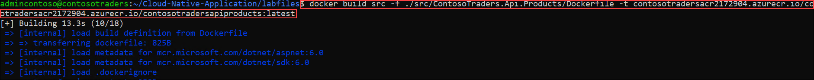

1. Run the below command to change the directory to `services` and open the `configService.js` file.

   ```
   cd src/ContosoTraders.Ui.Website/src/services
   sudo chmod 777 configService.js
   vi configService.js
   ```
    
   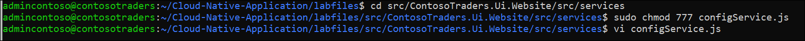
    
1. In the `vi` editor, press **_i_** to get into the `insert` mode. In the APIUrl and APIUrlShoppingCart, replace **deploymentid** with **<inject key="DeploymentID" enableCopy="true"/>** value and **REGION** with **<inject key="Region" enableCopy="true"/>** value. Then press **_ESC_**, write **_:wq_** to save your changes, and close the file. We need to update the API URL here so that the Contoso Traders application can connect to product API once it's pushed to AKS containers.
    
   >**Note**: If **_ESC_** doesn't work press `ctrl + [` and then write **_:wq_** to save you changes and close the file.
    

   ```
   const APIUrl = 'http://contoso-traders-productsdeploymentid.REGION.cloudapp.azure.com/v1';
   const APIUrlShoppingCart = 'https://contoso-traders-cartsdeploymentid.orangeflower-95b09b9d.REGION.azurecontainerapps.io/v1';
   ```

   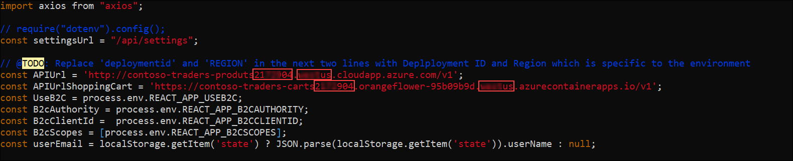

   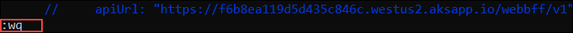

1. Run the below command to change the directory to the `ContosoTraders.Ui.Website` folder.

   ```
   cd
   cd Cloud-Native-Application/labfiles/src/ContosoTraders.Ui.Website
   ```

1. Now build the **contosotraders-UI-Website** docker image with the below command.

   ```
   docker build . -t contosotradersacr<inject key="DeploymentID" enableCopy="false"/>.azurecr.io/contosotradersuiweb:latest -t contosotradersacr<inject key="DeploymentID" enableCopy="false"/>.azurecr.io/contosotradersuiweb:latest
   ```    
    
   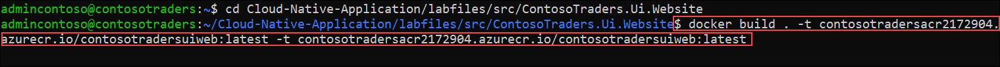
    
    
   >**Note**: Please be aware that the above command may take up to 5 minutes to finish the build. Before taking any further action, make sure it runs successfully. Also, you many notice few warnings related to npm version update which is expected and doesn't affect the lab's functionality.
    
1. Redirect to the **labfiles** directory before running the next steps.

   ```
   cd
   cd Cloud-Native-Application/labfiles/
   ```

1. Observe the built Docker images by running the command `docker image ls`. The images are tagged with the latest, also it is possible to use other tag values for versioning.

   ```
   docker image ls
   ```

   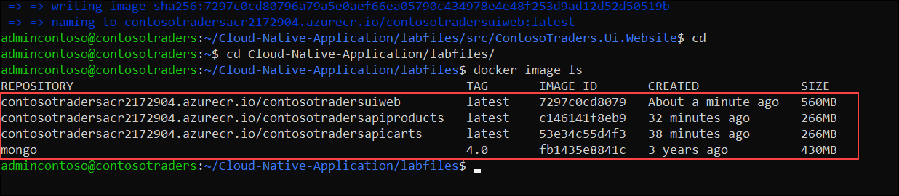

1. In the **Navigate** section, select **Resource groups**.

   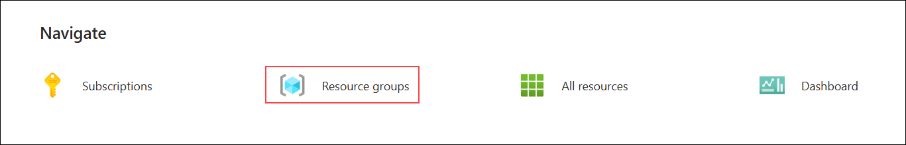

1. In the **Resource groups** list, select **ContosoTraders-<inject key="DeploymentID" enableCopy="false" />**.

   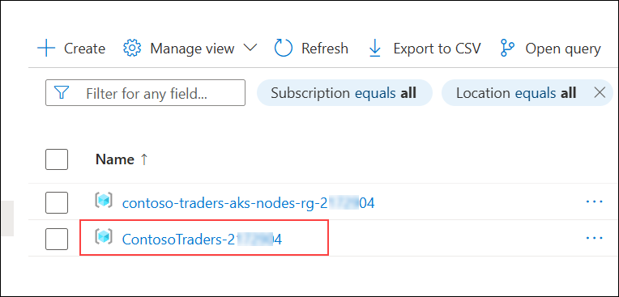

1. In the **Resources** list, search for **contosotradersacr<inject key="DeploymentID" enableCopy="false" /> (1)** and select it (2).

   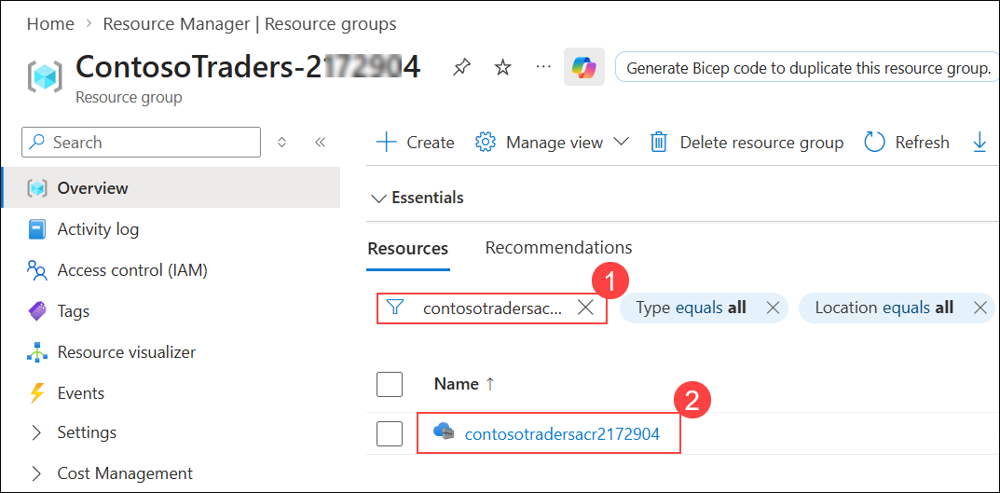
   
1. In **contosotradersacr<inject key="DeploymentID" enableCopy="false" />**, expand **Settings (1)**, select **Access keys (2)**, and copy the **Password (3)**.

   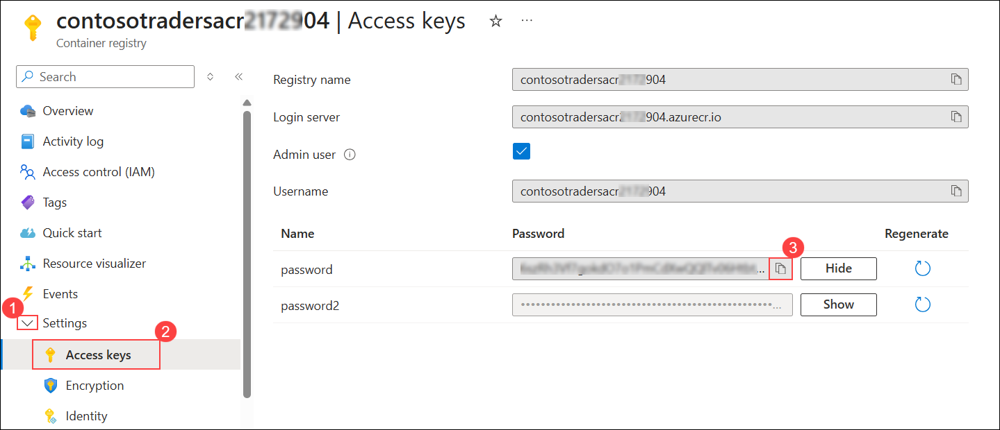  

1. Now switch back to **Command Prompt** and login to ACR using the below command, please update the ACR password value in the below command. You should be able to see that output below in the screenshot. Make sure to replace the password with the copied container registry password which you have copied in the previous step in the below command.

   ```
   docker login contosotradersacr<inject key="DeploymentID" enableCopy="false"/>.azurecr.io -u contosotradersacr<inject key="DeploymentID" enableCopy="false"/> -p [password]
   ```

   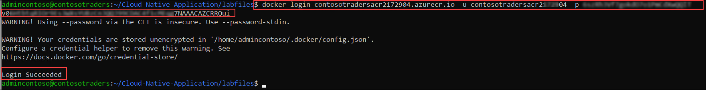

1. Once you log in to the ACR, please run the below commands to push the Docker images to the Azure container registry.

   ```
   docker push contosotradersacr<inject key="DeploymentID" enableCopy="false"/>.azurecr.io/contosotradersapicarts:latest 
   ```
   
   ```
   docker push contosotradersacr<inject key="DeploymentID" enableCopy="false"/>.azurecr.io/contosotradersapiproducts:latest
   ```
   
   ```
   docker push contosotradersacr<inject key="DeploymentID" enableCopy="false"/>.azurecr.io/contosotradersuiweb:latest
   ```
   
1. You should be able to see the docker image getting pushed to ACR as shown in the below screenshot. 
    
   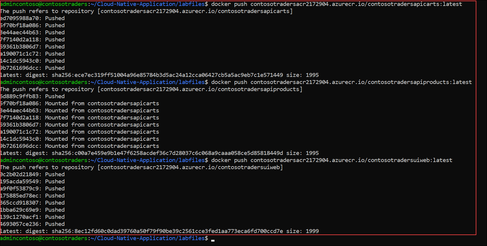

## Summary

In this exercise, you have deployed your containerized web application to AKS that contains, the namespace, service, and workload in Azure Kubernetes. Also, you have created a service to AKS and accessed the website using an external endpoint. Also, you have set up the secret of the key vault to access the MongoDB from AKS.

# Exercise 2: Migrate MongoDB to Cosmos DB using Azure Database Migration

## Estimated Duration: 60 Minutes

## Overview

In this exercise, you will be migrating your on-premises MongoDB database hosted over Azure Linux VM to Azure CosmosDB using Azure database migration. Azure Database Migration Service is a tool that helps you simplify, guide, and automate your database migration to Azure.

## Objectives

In this exercise, you will complete the following tasks:
- Task 1: Explore the databases and collections in MongoDB
- Task 2: Create a Migration Project and migrate data to Azure CosmosDB

### Task 1: Explore the databases and collections in MongoDB

In this task, you will be connecting to a Mongo database hosted over an Azure Linux VM and exploring the databases and collections in it.

1. While connected to your Linux VM, run the following command to verify whether MongoDB is installed:

   ```
   mongo --version
   ```

      

   >**Note:** If MongoDB is installed, proceed to the next step. If it is not installed, follow the troubleshooting steps provided below.

   >Run the **<inject key="Command to Connect to Build Agent VM" enableCopy="true" />** command, Type **yes** when it says **Are you sure you want to continue connecting (yes/no/[fingerprint])?** and enter the VM password **<inject key="Build Agent VM Password" enableCopy="true" />** to connect to the Linux VM using ssh. Please run the following commands.

   ```
   sudo apt install mongodb-server
   cd /etc
   sudo sed -i 's/bind_ip = 127.0.0.1/bind_ip = 0.0.0.0/g' /etc/mongodb.conf
   sudo sed -i 's/#port = 27017/port = 27017/g' /etc/mongodb.conf
   cd ~/Cloud-Native-Application/labfiles/src/developer/content-init
   npm ci
   nodejs server.js   
   sudo service mongodb stop
   sudo service mongodb start
   ```   

1. While connected to your Linux VM, run the following command to connect to the mongo shell to display the databases and collections in it using the mongo shell.

   ```
   mongo
   ```
   

1. Run the following commands to verify the database in the mongo shell. You should be able to see the **contentdb** **(1**) available and **item & products** **(2)** collections inside **contentdb**.

   ```
   show dbs
   use contentdb
   show collections
   ```
   
    

   >**Note**: In case you don't see the data inside the Mongo. Please follow the steps mentioned below.

   - Enter `exit` to exit from Mongo.

   - Please run the below-mentioned commands in the command prompt and perform steps 1 and 2 again.

      ```
      cd ~/Cloud-Native-Application/labfiles/src/developer/content-init
      sudo npm ci
      nodejs server.js
      ```        

### Task 2: Create a Migration Project and migrate data to Azure CosmosDB

In this task, you will create a Migration project within Azure Database Migration Service, and then migrate the data from MongoDB to Azure Cosmos DB. In the later exercises, you will be using the Azure CosmosDB to fetch the data for the products page. 

1. In the Azure portal search bar, enter **Virtual machines (1)** and select **Virtual machines (2)** from the Services list.

   

1. From the **Virtual machines** list, select the **contosotraders** virtual machine.

   

1. In the **Overview** pane, copy the **Private IP address**, and paste it into a notepad for later use.

   

1. In the Azure portal search bar, enter **Azure Cosmos DB (1)** and select **Azure Cosmos DB (2)** from the Services list.

   

1. In the **Azure Cosmos DB** page, use the filter **(1)** if required, and then select the **contosotraders-<inject key="DeploymentID" enableCopy="false" /> (2)** Cosmos DB resource.

   

1. From the left navigation pane, select **Data Explorer**.

   

   > **Note:** If you get **Welcome! What is Cosmos DB?** popup, close it by clicking on **X**.

1. In the **Data Explorer** pane, click the drop-down arrow **(1)** next to **New Collection**, and then select **New Database (2)**.

   

1. Provide name as `contentdb` **(1)** for **Database id**. Select **Provision throughput (2)** and then select **Databse throughput** as **Manual** **(3)**,  provide the RU/s value to `400` **(4)** and click on **OK (5)**.

   

   >**Note:** To see the configurations, ensure that Provision throughput is **Checked**.

1. In the Azure portal search bar, enter **Resource groups (1)** and select **Resource groups (2)** from the Services list.

   

1. From the **Resource groups** list, select the **ContosoTraders-<inject key="DeploymentID" enableCopy="false" />** resource group.

   

1. In the **Resources** list, use the filter **(1)** if required, and then select the **contosotraders<inject key="DeploymentID" enableCopy="false" /> (2)** Azure Database Migration Service resource.

   

1. On the Azure Database Migration Service blade, select **+ New Migration Project** on the **Overview** pane.

   

1. On the **New migration project** pane, enter the following values and then select **Create and run activity (5)**:

   - **Project name**: `contoso` **(1)**
   - **Source server type**: `MongoDB` **(2)**
   - **Target server type**: `Cosmos DB (MongoDB API)` **(3)**
   - **Choose type of activity**: `Offline data migration` **(4)**

      

      >**Note**: The **Offline data migration** activity type is selected since you will be performing a one-time migration from MongoDB to Cosmos DB. Also, the data in the database won't be updated during the migration. In a production scenario, you will want to choose the migration project activity type that best fits your solution requirements.

1. On the **MongoDB to Azure Database for CosmosDB Offline Migration Wizard** pane, enter the following values for the **Select source** tab:

   - Mode: **Standard mode (1)**
   - Source server name: Enter the Private IP Address of the Build Agent VM used in this lab. **(2)**
   - Server port: `27017` **(3)**
   - Require SSL: Unchecked **(4)**
   - Choose **Next: Select target >> (5)**

      > **Note:** Leave the **User Name** and **Password** blank as the MongoDB instance on the Build Agent VM for this lab does not have authentication turned on. The Azure Database Migration Service is connected to the same VNet as the Build Agent VM, so it's able to communicate within the VNet directly to the VM without exposing the MongoDB service to the Internet. In production scenarios, you should always have authentication enabled on MongoDB.

      

      > **Note:** If you face an issue while connecting to the source DB, with an error connection refused. Please run the following commands in **build agent VM connected in CloudShell**. You can use the **Command to Connect to Build Agent VM**, which is given on the lab environment details page.

      ```bash
      sudo apt install mongodb-server
      cd /etc
      sudo sed -i 's/bind_ip = 127.0.0.1/bind_ip = 0.0.0.0/g' /etc/mongodb.conf
      sudo sed -i 's/#port = 27017/port = 27017/g' /etc/mongodb.conf
      sudo service mongodb stop
      sudo service mongodb start
      ```

1. On the **Select target** pane, select the following values:

   - Mode: **Select Cosmos DB target (1)**
   - Subscription: Select the Azure subscription you're using for this lab. **(2)**
   - Select Cosmos DB name: Select the **contosotraders-<inject key="DeploymentID" enableCopy="false" /> (3)** Cosmos DB instance.
   - Select **Next: Database setting >> (4)**.

      

      >**Note:** Notice, the **Connection String** will automatically populate with the Key for your Azure Cosmos DB instance.

1. On the **Database setting** tab, select the `contentdb` as **Source Database (1)**, so this database from MongoDB will be migrated to Azure Cosmos DB. Select **Next: Collection setting >> (2)**.

   

1. On the **Collection setting** tab, expand the **contentdb** database, and ensure both the **products** and **items** collections are selected for migration **(1)**. Also, update the **Throughput (RU/s)** to `400` **(2)** for both collections and select **Next : Migration summary >> (3)**.

   

1. On the **Migration summary** tab, enter `MigrateData` **(1)** in the **Activity name** field, and then select **Start migration (2)** to initiate the migration of the MongoDB data to Azure Cosmos DB.

   

1. Wait for a few seconds after the migration starts, and then select **Refresh**.

   

1. The migration activity's status will be displayed. The migration will be finished in a matter of seconds.

   

1. Select **Data Explorer (1)** from the left menu. You will see the `items` and `products` collections listed within the `contentdb` database **(2)** and you will be able to explore the documents **(3)**.

   

1. You will see the `items` and `products` collections listed within the `contentdb` database and you will be able to explore the documents.

1. Within the **contosotraders-<inject key="DeploymentID" enableCopy="false" />** Azure Cosmos DB for MongoDB account (RU), Select **Quick start** **(1)** blade from the left menu and **Copy** the **PRIMARY CONNECTION STRING** **(2)** and paste it into the text file for later use in the next exercise.

   

#### Validation

> **Congratulations** on completing the task! Now, it's time to validate it. Here are the steps:
> - If you receive a success message, you can proceed to the next task.
> - If not, carefully read the error message and retry the step, following the instructions in the lab guide. 
> - If you need any assistance, please contact us at labs-support@spektrasystems.com. We are available 24/7 to help you out.
<validation step="ee0ef7bb-5d78-4a69-8e01-f3df1020fb41" />

## Summary

In this exercise, you have completed exploring your on-prem Mongodb and migrating your on-premises MongoDB database to Azure CosmosDB using Azure database migration.

### You have successfully completed the prerequisite exercises. Click on the Next button.

